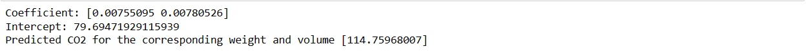

# Implementation of Multivariate Linear Regression
## Aim
To write a python program to implement multivariate linear regression and predict the output.
## Equipment’s required:
1.	Hardware – PCs
2.	Anaconda – Python 3.7 Installation / Moodle-Code Runner
## Algorithm:
Step 1

Import pandas

Step 2

Import linear model from sklearn

Step 3

Read the files cars.csv

Step 4

Assign the values for x and y as requried

Step 5

Create the LinearRegression model and predic the output

## Program:
```
Developed by: DIVYA E
RegisterNumber: 212223230050
import pandas as pd
from sklearn import linear_model
df=pd.read_csv('cars.csv')
x=df[['Weight','Volume']]
y=df['CO2']
regr=linear_model.LinearRegression()
regr.fit(x,y)
print("Coefficient:",regr.coef_)
print("Intercept:",regr.intercept_)
predictedCO2=regr.predict([[3300,1300]])
print("Predicted CO2 for the corresponding weight and volume",predictedCO2)
```
## Output:


<br>

## Result
Thus the multivariate linear regression is implemented and predicted the output using python program.